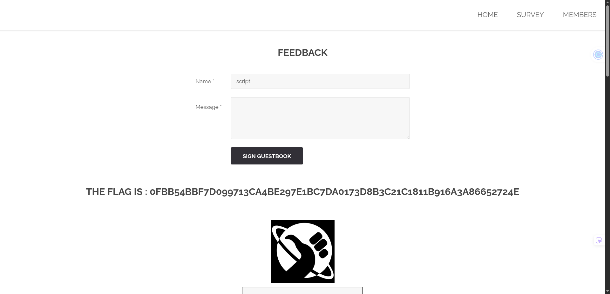

## how to find the flag

The vulnerability was found on the **feedback page**, where user input from the name and
message fields is accepted and processed without proper sanitization.

By submitting the keyword "script", it was confirmed that the application does not
filter potentially dangerous input. The server accepts and reflects user input without
validation, which leads to a Cross-Site Scripting vulnerability.

This represents a security issue because malicious JavaScript code could be injected
and executed in the context of the page.

## how to avoid

This vulnerability is a Cross-Site Scripting issue caused by the lack of server-side
input sanitization on user-submitted data.

Even if no script execution is visibly triggered, accepting unfiltered input allows
attackers to inject malicious payloads using different HTML or JavaScript vectors.

In real-world applications, stored XSS vulnerabilities can be exploited to steal user
sessions, perform unauthorized actions, or compromise accounts.

To prevent this issue, user input must be properly escaped before being rendered, and
dangerous content should be filtered server-side with a trusted sanitizer. Apply
context-aware output encoding (HTML, attributes, URLs, JavaScript) everywhere content is
rendered, and treat rich text as plain text unless explicitly required. Add a strict
Content Security Policy and secure cookie settings to reduce impact if any XSS bypasses
input filtering.
