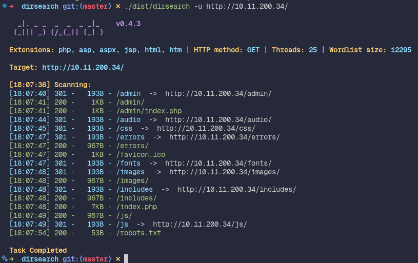
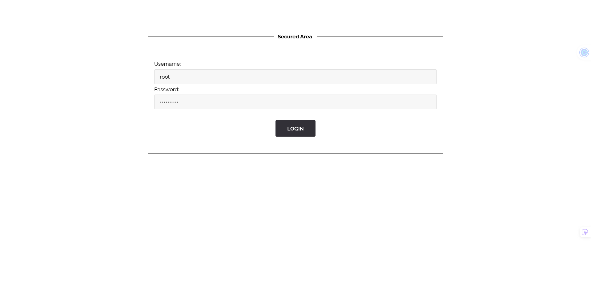

## how to find the flag
The vulnerability was discovered through directory enumeration.

Using a directory brute-force tool dirsearch that I installed, it was observed that the application exposed an
`/admin` directory protected by authentication. Since no credentials were available,
further enumeration of the website was performed.



By inspecting the robots.txt file, two entries were found, including a directory named
`whatever/`. Accessing this directory revealed a file named `htpasswd`.


This file was accessible directly through the browser. Its content contained a hashed password in the following format:

```
root:437394baff5aa33daa618be47b75cb49
```

The hash was then cracked using an `crackstation.net` cracking service, revealing the
cleartext password.


Using these credentials, it was possible to authenticate on the /admin page and retrieve
the flag.



This represents a security issue due to the exposure of sensitive authentication files
and insufficient access control.

## how to avoid

The `robots.txt` file is not a security mechanism and should only be used to give indexing
instructions to search engines.

Sensitive directories must not be protected by hiding them in robots.txt, as this file
is publicly accessible and can reveal valuable information to attackers.

To prevent this issue, keep sensitive files (such as `.htpasswd`, backups, and config
files) outside the web root and block direct HTTP access with web server rules. Access
control must always be enforced server-side with proper authentication and authorization,
and `robots.txt` must never be treated as a protection layer. Add periodic scans of
deployed content to detect accidentally exposed files early.
