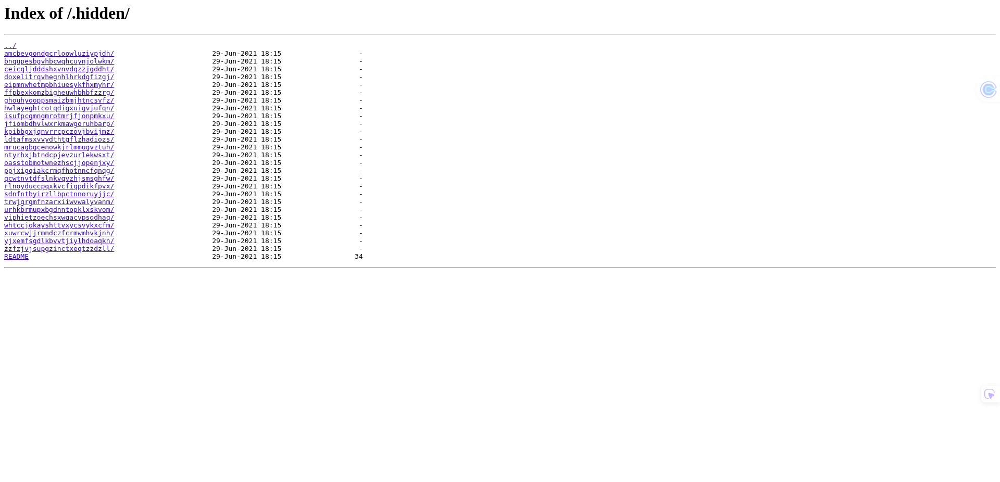

## how to find the flag
The vulnerability was found in the `/.hidden` directory which was listed in `robots.txt`.

This directory was publicly accessible and contained a large recursive structure of
subdirectories. Many of these directories contained README files that could be accessed
directly through HTTP.

By enumerating the directories and reading the README files, it was possible to find a
README containing the flag using the `script.py`.

This is a security issue because internal files and directory listings should not be
exposed publicly, as they can leak sensitive information and help attackers discover
hidden content.

## how to avoid
This issue occurs because directory listing and sensitive internal content are exposed
under a publicly accessible path (`/.hidden`).

Even if the content looks harmless, exposing deep directory structures and README files
can leak secrets, internal notes, credentials, or hints that enable further attacks.

To prevent this issue, disable directory indexing and block access to internal or hidden
paths by default. Remove development artifacts (README notes, backups, scripts) from
production builds, and keep internal content separate from public assets. Add routine
deployment checks and security scans to detect accidentally exposed directories.
