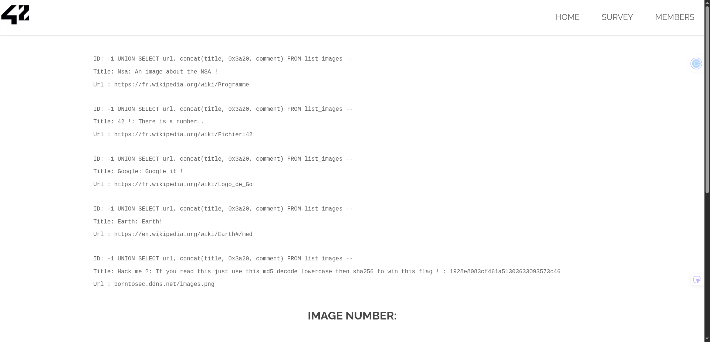

## how to find the flag

The vulnerability was found in the **image search** functionality (``searchimg``), where a
user-provided parameter is directly concatenated into a SQL query.

By testing SQL payloads, it was determined that the query was vulnerable to a UNION-based
SQL injection. The number of columns was identified, and the visible output fields were
mapped to understand how injected data was rendered in the page.

```sql
5 ORDER BY 3 --
```

Same thing as for the `10-member-sql-injection` we know there are already both columns displayed in the UI.

Using this injection point, it was possible to enumerate the database schema through the
information_schema tables, which revealed the existence of a table named `list_images`
containing image-related data.
```sql
-1 UNION SELECT 1, group_concat(table_name) FROM information_schema.tables WHERE table_schema=database() --
```

By extracting the contents of this table, an instruction message and a hashed value were
retrieved. The instruction specified how the hash should be transformed in order to
generate the final flag.

```sql
-1 UNION SELECT 1, group_concat(column_name) FROM information_schema.columns WHERE table_name=0x6c6973745f696d61676573 --
```

```sql
-1 UNION SELECT url, concat(title, 0x3a20, comment) FROM list_images --
```



This confirms that the image search feature is vulnerable to SQL injection and allows
arbitrary database data extraction.

## how to avoid
This vulnerability occurs because user input is directly embedded into SQL queries
without proper sanitization or the use of parameterized queries.

The SQL injection allowed full enumeration of the database schema and access to
application logic stored in database fields, including instructions required to
generate the flag.

In real-world applications, such vulnerabilities can lead to full database compromise,
credential leakage, and exposure of sensitive business logic.

To prevent this issue, use prepared statements for every query (including search
features) and treat user input strictly as data. Validate parameters against expected
format and length before they reach the database layer, and hide detailed SQL errors
from users. Restrict database permissions and monitor for suspicious patterns such as
`UNION` or `information_schema` access attempts.
