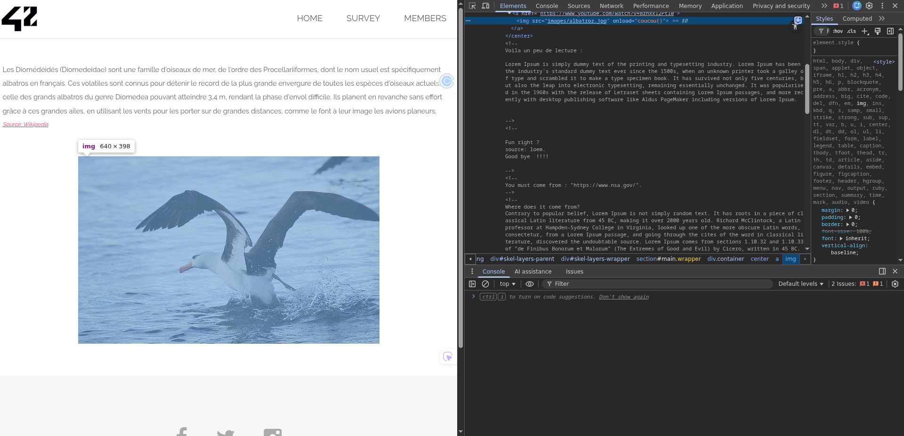

## how to find the flag

The vulnerability was found on the page reached by clicking the **copyright link** in the
footer.

This page contains an image and background music. By inspecting the HTML source of the
page, several comments were discovered that provided hints about access conditions.
Specifically, the comments indicated that the request must originate from a specific
**referer** (`https://www.nsa.gov/`) and use a specific browser identified by the
`ft_bornToSec` **User-Agent**.



By manually crafting an HTTP request and modifying the Referer and User-Agent headers
accordingly, it was possible to access the page content and retrieve the flag.

```bash
$ curl \
  -H "Referer: https://www.nsa.gov/" \
  -H "User-Agent: ft_bornToSec" \
  "http://x.x.x.x/?page=b7e44c7a40c5f80139f0a50f3650fb2bd8d00b0d24667c4c2ca32c88e13b758f" > index.html
```

This represents a security issue because the application relies on client-controlled HTTP
headers to enforce access restrictions.

## how to avoid

This vulnerability occurs because HTTP headers such as Referer and User-Agent are fully
controlled by the client and can be modified easily.

Relying on these headers for access control provides no real security, as attackers can
forge them using tools such as curl or custom HTTP clients.

In real-world applications, this can lead to unauthorized access to protected resources
if sensitive logic depends on request metadata instead of proper authentication or
authorization mechanisms.

To prevent this issue, do **not** use `Referer` or `User-Agent` to decide whether a user is allowed to view a page, because the client can fake those headers.

Instead, enforce access **on the server** with proper mechanisms such as:

- **Authentication** (login)
- **Sessions/cookies** managed by the server
- **Tokens** (e.g., signed tokens)

Then, protect sensitive pages with **authorization checks** (for example, role-based access control) before returning the content.

`Referer` and `User-Agent` can still be used for **logging/monitoring**, but only as _informational signals_, never as security gates. Also, keep **audit logs** of access/deny decisions to help investigate incidents.
