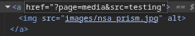

## how to find the flag

The vulnerability was found on the home page containing multiple images. Only the third
image was wrapped inside an anchor tag that redirects the user to another page.



By inspecting this anchor tag, it was observed that the value of its "src" parameter was
passed to the next page and reused to populate the "data" attribute of an HTML object
element.


After confirming that the value provided in the anchor tag was reflected directly inside
the object tag without sanitization (put `'/'` in the `src` and you'll see the home page inside that redirected page), it was possible to control the content loaded by the
object.

By supplying a data URI containing a base64-encoded HTML payload:
```bash
$ echo "<script>alert(yes)</script>" | base64
PHNjcmlwdD5hbGVydChoZWxsbyk8L3NjcmlwdD4K

# so for the src attribute of the anchor tag I put:
src=data:text/html;base64,PHNjcmlwdD5hbGVydChoZWxsbyk8L3NjcmlwdD4K
```
JavaScript code was
decoded and executed by the browser. This resulted in the execution of the injected
script and the retrieval of the flag.

This behavior represents a reflected Cross-Site Scripting (XSS) vulnerability caused by
the direct reuse of user-controlled input inside a dangerous HTML context.

## how to avoid

This XSS vulnerability occurs because user input is directly reflected into the HTML
content without proper encoding or sanitization.

The application embeds the user-controlled value inside an object tag, which allows
the execution of HTML content provided through data URIs. This enables an attacker to
inject and execute arbitrary JavaScript code in the context of the page.

In real-world applications, XSS vulnerabilities can be exploited to steal session
cookies, perform actions on behalf of users, or compromise accounts.

To prevent this vulnerability, user input must be properly escaped depending on the
HTML context, and dangerous tags such as object should be avoided or strictly restricted.
