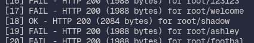

## how to find the flag

The vulnerability was found on the **login page**.

Authentication could be bypassed by performing a credential brute-force attack using
lists of **common** **usernames** (`usernames.txt`) and common **passwords** (`passwords.txt`). The application allowed a large number
of login attempts without effective protections such as rate limiting, delays, CAPTCHA,
or account lockout.

By testing common credential combinations, valid credentials were discovered and used to
log into the application, which resulted in the flag being returned.

This is a security issue because weak credentials combined with unlimited attempts make
accounts easy to compromise.

## how to avoid

This vulnerability is caused by two factors: the use of guessable credentials and the
absence of protections against repeated login attempts.

In real-world applications, attackers can automate large numbers of authentication
requests and quickly compromise accounts when rate limiting, progressive delays,
lockouts, or multi-factor authentication are not in place.

To mitigate this, enforce strong password policies, prevent credential stuffing with
rate limiting and progressive delays, add CAPTCHA or other bot protections, monitor and
alert on abnormal login patterns, and use MFA for privileged accounts.
